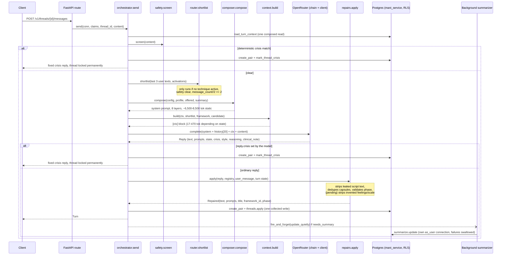

# Mani AI layer — Phase 0 audit

Read-only verification of the prior audit against the committed baseline (`mani-backend-fastapi`
as of the commit this worktree branched from), plus everything Section L of the brief left
unread. Nothing in `mani/`, `content/`, or `supabase/` was modified to produce this report.

**Baseline note.** This worktree already carries three uncommitted, unstaged changes that predate
this audit and are *not* reflected in the CONFIRMED/PARTIAL/REFUTED table below — the table
describes the codebase as committed, matching what the original audit was written against:

1. A style-wiring fix (`mani/chat/context.py`, `mani/prompts/composer.py`,
   `content/prompts/mani_base.md`) — emits `style: <value>` into `[ctx]`, removes the
   contradicting free-text style sentence from the system prompt, and renames `Directive` →
   `Direct` throughout the prompt to match the DB enum. This satisfies Phase 3 items 4 and 5
   below, already written and tested, not yet committed.
2. A deterministic repair (`mani/chat/repairs.py`, `mani/chat/orchestrator.py`) that strips any
   sentence introducing a feeling word or scale phrase the person did not use, wired into the
   existing repair pipeline. Not requested by the original audit — found live, during manual
   testing, after the style fix above. Not yet committed.
3. Matching test files for both of the above.

Everything else in this report is scored against the code as if neither existed.

**Supersession note (added when this document was brought into the main tree).** The two
uncommitted changes described in the baseline note above were written in an isolated git
worktree (`.claude/worktrees/mani-response-quality`) and never committed there. A separate,
later pass implemented the same two problems directly on `mani-backend-fastapi` — differently
and more completely (per-thread `conversation_style` wired through `PATCH /v1/threads/{id}`
rather than a bare `style:` line; capsule-level validation of feeling words, self-judgments,
label length, and library sections in `repairs.py`, plus a `Style` shape/voice check, rather
than stripping sentences out of prose; and an additional fix, not anticipated by this audit,
to a crisis-turn bug where `thread_technique_state` could stay mid-flight forever). That
version is what is now in the main tree; the worktree's version was discarded. So:

- **A1–A4** (style never reaches the model) and the "pending style fix" language throughout —
  **fixed**, by the main-tree version, not the one this report describes as pending.
- **A5** (`validators.py` never runs against a model-generated reply) — **still open**. Neither
  version touched this; see `backend/scripts/eval_replies.py`, added alongside this document
  for exactly this gap.
- **K1, K3, F4, N1, N2, N3, N4** and everything in §§2–7 — untouched by either version, still
  as described below. Not re-verified as part of adding this note; see the session's separate
  compatibility report for a fresh check of N1/N2/N3/N4/F4 against the current main tree.

---

## 1. Status table

Legend: **C** = confirmed as described. **P** = partially correct, see note. **R** = refuted.
**N** = new, not in the original audit.

### A. Style system

| ID | Status | Evidence |
|---|---|---|
| A1 | **C** | `composer.py:99-100` @ HEAD: `if profile.support_style: lines.append(f"They asked for a {profile.support_style} style of support.")` — the entire style instruction outside a framework. |
| A2 | **C** | `context.py:75-76` @ HEAD: `lines: list[str] = []` — no `style:` line ever emitted. The only style-varying output is `_stage_lines(..., style)`'s single `ask` line, reached only when `technique is not None` or a confident `candidate` exists. |
| A3 | **C** | `mani_base.md:61-94` @ HEAD says **Directive**; `SupportStyle` enum, `002_...sql:17-19` check constraint, and every framework's `ask` key say `direct`. `profile.support_style` free text is a second channel (A1). |
| A4 | **C** | `routers/threads.py:105-108` wires `PATCH /v1/threads/{id}` to `conversation_style`. The comment at `context.py:17` ("not wired to any endpoint yet") is confirmed stale in the committed baseline. |
| A5 | **C** | `tests/evals/validators.py` is called only from `tests/evals/test_negative_set.py` against ten hardcoded `FORBIDDEN`/`PERMITTED` string pairs transcribed from framework docs. Zero call sites pass a model-generated reply. |

### B. Data model

**C** as a whole. Exact `CREATE TABLE` line ranges (`001_initial_schema.sql`): `threads` 168–177,
`messages` 188–204, `thread_technique_state` 213–222, `thread_techniques_offered` 229–235,
`thread_response_styles` 242–250, `thread_summaries` 263–273, `admin.llm_calls` 322–337,
`admin.crisis_events` 298–307, `profiles` 144–159. `sync_thread_message_count` trigger function at
374–392, bound 394–396. `002_...sql:12-14` adds `conversation_style` and `vague_streak`. Every
`COLUMNS` constant in `mani/db/*.py` matches its table except `threads.py:23-26`, which omits
`vague_streak` (see C1).

### C. Dead or unread things

| ID | Status | Evidence |
|---|---|---|
| C1 | **C** | `vague_streak` absent from `threads.COLUMNS`; zero references anywhere in `backend/**/*.py`. |
| C2 | **C** | `002_...sql:61` comment: "stops being read for routing", mirrored at `models/rows.py:133`. Read only for seeding/serialization (`config_tables.py:23`), never by the router. |
| C3 | **C** | `Profile.age_bracket` (`models/rows.py:55`) — `composer.user_context()` reads only `nickname` (:99) and `topics` (:101). |
| C4 | **C** | `002_...sql:99-134` defines `create_greeting(p_thread_id, p_content, p_prompt_options jsonb default null)`; `messages.py:181-186` still calls it with 2 args. |
| C5 | **C** | `llm_calls.py:82` `spend_since()` — only other reference in the repo is a test (`tests/integration/test_queries.py:285`). |
| C6 | **C** | `Framework.body`, `.summary`, `.activation_conditions` — zero reads in `mani/` outside model/column declarations. `appropriate_when`, `not_when`, `redirects` — zero hits anywhere in `mani/`. |

### D. Null and edge-case surprises

| ID | Status | Evidence |
|---|---|---|
| D1 | **C** | `orchestrator.py:137-158`: `content=reply_message.content if reply_message else ""`, `message_id=... else None`, `created_at=... else None`. |
| D2 | **C** | `001_initial_schema.sql:549-565`, `create_message_pair`'s duplicate branch: `mani_message_id` is a correlated subselect that returns NULL when no Mani row exists yet. |
| D3 | **C** | `001_initial_schema.sql:268`: `summarized_through_message_id uuid references public.messages (id) on delete set null`. |

### E. History, tokens, cost

| ID | Status | Evidence |
|---|---|---|
| E1 | **C** | `messages.py:20` `CONTEXT_WINDOW = 20`; `recent_for_context` (:61-84): inner `ORDER BY created_at DESC LIMIT $3`, outer re-sort ascending. |
| E2 | **C** | Grep for `tiktoken\|count_tokens\|truncat\|budget\|context_window\|max_input` across `backend/` returns only unrelated hits (retry-budget prose, the `CONTEXT_WINDOW` name itself). No token accounting exists pre-call. |
| E3 | **C** | `api.py:63`: `content: str = Field(min_length=1, max_length=4000)`. |
| E4 | **C** | No caller of `spend_since`; `rate_limit`/`daily_spend` greps only hit the generic HTTP 429 error category, not a spend check. |
| E5 | **C** | `composer.py:139-179`, comment at :149-151 confirms layers 1–3 (`mani_base`, `framework_index`, `response_format`) "never vary". Zero occurrences of `cache_control` under `mani/`. |

### F. Summarisation

| ID | Status | Evidence |
|---|---|---|
| F1 | **C** | `summarize.py:21` `BATCH = 200`; `_since_checkpoint` :46-64; `update()` :68-138. |
| F2 | **C** | `orchestrator.py:47` `SUMMARY_THRESHOLD = 30`; trigger at :399. `routers/messages.py:58,63` dispatches via `fire_and_forget`, explicitly not `BackgroundTasks` (comment explains why). |
| F3 | **C** | Read path traced intact: `_TURN_CONTEXT_SQL` → `TurnContext.summary` → `orchestrator.py:256` → `composer.compose` → `## Conversation Context` layer; `techniques_tried` also in `[ctx]` as `history:`. |
| F4 | **C — still live** | `SUMMARY_THRESHOLD (30) > CONTEXT_WINDOW (20)`, confirmed unchanged by `git diff HEAD` — neither constant is touched by the pending uncommitted style fix. No fix is in flight for this. |

### G. Profile and memory

| ID | Status | Evidence |
|---|---|---|
| G1 | **C** | `routers/profile.py:20-30` → `profiles.upsert` (`profiles.py:20-46`). Every other `profiles.upsert`/`profiles.get` call site in `mani/` is a **read** (`orchestrator.py:531`). Zero chat-path writes. |
| G2 | **C** | Nickname → greeting (`greeting.py:9`) and `## User Context`; `support_style` → style resolution and (pending fix) free text; `age_bracket` → nothing. |
| G3 | **C** | `_has_earlier_thread` (`orchestrator.py:539-548`) is a plain boolean `EXISTS` query, nothing richer. |
| G4 | **C** | `public.profiles` is the only table with `user_id` as sole/primary key in either migration. |

### H. Per-thread state

**C** as a whole. `conversation_style` written `threads.py:260-267` via `ThreadUpdates.apply`,
read `context.py:48-49`. `thread_technique_state` written/upserted `threads.py:245-296`.
`library_offered_since` set `threads.py:320`, read `context.py:91`. `thread_techniques_offered`
written in the same `apply()`. `thread_response_styles`: `STYLE_WINDOW = 7` (`threads.py:30`),
used in the recent-styles subquery (:179). `crisis_detected`/`mark_thread_crisis`: written via
`threads.py:326-334` → `mark_thread_crisis(...)` SQL function, called from `_handle_crisis`
(`orchestrator.py:507`), read at `orchestrator.py:169`.

### I. Content layer

| ID | Status | Evidence |
|---|---|---|
| I1 | **C** | `mani_base.md` @ HEAD, 322 lines. Section line numbers match to within 1 line (sympathy-line-is-a-label section actually starts :102, audit said :103). All quoted text confirmed verbatim. |
| I2 | **C** | `response_format.md`, 173 lines. All quoted rules and line numbers confirmed verbatim. |
| I3 | **C** | `summarization.md` frontmatter: `model_id: openai/gpt-oss-120b`, `temperature: 0`, `maxTokens: 500`. Used only by `summarize.py:90`. |
| I4 | **P** | Mechanism confirmed but the "4th message" framing is imprecise — the actual gate is `TITLE_AFTER_MESSAGES = 3` (`orchestrator.py:44`) against `thread.message_count`, not a literal 4th-message count. |
| I5 | **P — see §3 for the corrected number** | The 85% figure conflates two different questions (permanently-dead content vs. not-injected-this-turn). Meta-instruction leakage confirmed, but two of the four originally-cited lines (`abcde.md:116`, `thought_reframe.md:151`) are in `if_unclear.reply`, not `ask` — same defect class, wrong field name. **New, stronger evidence**: the leak was confirmed live in an actual `[ctx]` block built by calling `context.build()` directly, not just in the source markdown. |
| J1 | **C** | `compose()` layer order unchanged in the working tree: `mani_base → framework_index → response_format → user_context → [title_generation] → techniques_used → debug → summary`. |
| J2 | **C** | `Config` (`cache.py:30-49`); TTL 1s dev / 300s prod (`config.py:11-12,104-109`); `invalidate()` called only from `routers/admin.py:44,66,105`. `scripts/seed.py` has zero occurrences of "invalidate". |
| J3 | **C** | `parse_prompt` requires `name` (:31-32); `parse_framework` requires `id`, `name`, `phases` (:55-57). No cross-validation of `phases` against `stages` keys anywhere in `seed.py`. |

### K. Prompt-quality hypotheses

| ID | Status | Evidence |
|---|---|---|
| K1 | **C** | Do-not-label rule (:96-115) + presence gated behind three conditions (:139-154) + "never open two replies the same way" (:153-154) narrows the six defined response shapes to effectively one reachable pattern. |
| K2 | **C** | `:98-107` forbids naming/sympathy; `:130` offers Naming ("That is grief") as a supportive move; `:301` marks "I'm here. What do you need right now?" ✓ while `:89` forbids the same opener in Reflective. |
| K3 | **C** | `mani_base.md:176-265` (offering/running/ending) is unconditionally in layer 1 per J1 — no `framework_engaged` gate exists in the committed `compose()`. |
| K4 | **C** | `response_format.md:127-134` + 11-row failure table (:136-151) + 7-item checklist (:157-174), matches I2. |
| K5 | **C** | `temperature: 1` confirmed unchanged at HEAD. |
| K6 | **C** | All three sub-claims hold: `mani_base.md:158-159` (six-shape tracking from one compressed line), `response_format.md:52-60` (ordered 5-step reasoning field), **and literal em-dashes confirmed present in `response_format.md` at lines 16, 39–46, 55** despite the file's own "no dashes" rule at :117 — I checked this directly with a grep for U+2014. |
| K7 | **P** | Mechanism confirmed (the "Telling them apart" block is unconditional, sent whenever any framework is registered, not gated on the offering moment) — `composer.py:68-80`. The specific "~500 tokens" figure is not independently isolated; the whole generated `framework_index` (index table + distinctions combined) measures 1,137 tokens (o200k_base), but that wasn't split by sub-block. |
| K8 | **C** | Layer order (`framework_index` = 2, `response_format` = 3) currently makes `response_format.md:108`'s "the index above" correct. No test protects this ordering in the committed suite. |

---

## 2. New findings (not in the original audit)

**N1 — `Reply` schema honesty gap.** Three fields on `mani.llm.schema.Reply` — `state`,
`reasoning`, `clinical_note` — are documented as **"Required"** in their Pydantic
`description=` text, but are typed `X | None` (Optional). Nothing in the schema itself enforces
their presence; "required" is prose the model may or may not honor, not a contract Pydantic
checks. (`mani/llm/schema.py`)

**N2 — the meta-instruction leak reaches the live prompt, not just the source markdown.**
Verified by constructing a real `[ctx]` block via `context.build()` with fixture data: a
mid-framework `stage_ask` line included the literal text `"- the feeling word should match what
the user named..."` — the model receives the authoring instruction as part of what it's told to
say, every time that stage is reached. This is a stronger, turn-level confirmation of the
audit's I5 hypothesis.

**N3 — `greeting.py`'s text is fully hardcoded English**, not sourced through any dictionary or
strings table. Two literal strings (`"It's Mani."` / `"Nice to see you again."`) and the
`"Hi {nickname}. ... How can I support you today?"` template live directly in Python. Worth a
line in the eventual i18n backlog; not urgent.

**N4 — the "85% dead" framing needs correcting** (see §3 below). Keep this correction visible if
it's repeated anywhere else in prior reporting to muhammad.

---

## 3. Correcting the "85% dead" framing

Earlier reporting (mine, in conversation, not in the original written audit) said framework files
are "~85% invisible to the model." That number was directionally motivated but measured the wrong
thing. There are two different questions, and they have two different answers:

**Question A — "of this file's content, how much can *never* reach the model, on any turn,
under any circumstance?"** This is the genuinely dead fraction: `body`, `summary`,
`activation_conditions`, `appropriate_when`, `not_when`, `redirects`. Measured with a tokenizer
against all six files:

| Framework | Full file (tok) | Frontmatter — live code path (tok) | Dead forever (tok) | Dead % |
|---|---:|---:|---:|---:|
| abcde | 3,859 | 2,879 | ~980 | 25.4% |
| act_choice_point | 4,544 | 3,373 | ~1,171 | 25.8% |
| behavioral_activation | 4,391 | 3,260 | ~1,131 | 25.8% |
| dbt_stop | 4,278 | 3,007 | ~1,271 | 29.7% |
| structured_problem_solving | 4,539 | 3,351 | ~1,188 | 26.2% |
| thought_reframe | 4,048 | 2,947 | ~1,101 | 27.2% |

That's **25–30%**, not 85%.

**Question B — "of this file's content, how much reaches the model on any single given
turn?"** This is what the "85%" framing was actually gesturing at, and here the real number is
higher than 85%, not lower — because most of a framework's frontmatter (every other stage's
`purpose`/`listen_for`/`boundaries`/`ask` for all three styles) is legitimately live code that
simply isn't relevant to *this* turn's single current+next stage:

| Turn state (`[ctx]` block, abcde fixture) | Tokens injected | vs. full file (3,859 tok) |
|---|---:|---:|
| No framework | 17 | 0.4% |
| Framework offered (confident) | 129 | 3.3% |
| Framework running (mid-stage) | 470 | 12.2% |
| Framework ending | 239 | 6.2% |

So per turn, **88–99.6%** of the file's content is absent from that turn's prompt — a larger
number than 85%, but for a mostly benign reason (other stages exist for other turns), not
because most of the file is dead weight.

**The corrected statement:** roughly a quarter of each framework file is permanently dead prose
that can be deleted with zero runtime effect (Question A). The much larger "not present this
turn" fraction (Question B) is mostly *not* waste — it's the framework's other stages, doing
their job on other turns. Don't conflate the two when deciding what's safe to cut.

---

## 4. File-by-file map

### 4.1 Authored content (`backend/content/`) — seeded into Postgres, never read from disk at runtime

| File | Reaches the model? |
|---|---|
| `prompts/mani_base.md` | Yes — layer 1, ~4,127 tok (o200k_base estimate; not the real Gemini tokenizer) |
| `prompts/response_format.md` | Yes — layer 3, ~2,406 tok |
| `prompts/title_generation.md` | Only when `message_count >= TITLE_AFTER_MESSAGES (3)` and no title yet, ~40 tok |
| `prompts/summarization.md` | No — used only by the background summarizer, own model/temperature |
| `frameworks/*.md` (×6) | Frontmatter only, and only the current+next stage per turn — see §3 |

### 4.2 Prompt assembly (`backend/mani/prompts/`)

- `cache.py` — process-global `Config` snapshot, TTL-based reload (1s dev / 300s prod), hard-required `mani_base`/`response_format`.
- `composer.py` — `compose()` fixed 8-layer order; `framework_index()` generates the index + distinctions table from the registry; `model_settings()` reads model/temperature off the `mani_base` DB row, not env.

### 4.3 Per-turn context (`backend/mani/chat/context.py`)

`build()` assembles `[ctx]`; `resolve_style()` picks `thread.conversation_style` ?? `profile.support_style` ?? `"supportive"`; `_stage_lines()` renders one stage's guidance, including exactly one `ask` for the resolved style.

### 4.4 Turn logic (`backend/mani/chat/`)

`orchestrator.py` (one turn, one provider call, one collected write) · `safety.py` (deterministic pre-generation screen, `Level.NONE/CONCERN/CRISIS`) · `router.py` (5 hardcoded `DISCRIMINATORS`, substring scoring, `is_confident` gate: `score>=2.0` AND (`time_critical` OR `spread>=2` OR `matched>=2`) AND `margin>=1.0`, `PROMOTED_FLOOR=1.5`) · `repairs.py` (code-level corrections, no second model call) · `techniques.py` (framework `Registry`) · `greeting.py` (hardcoded strings, no i18n — N3) · `crisis.py` (fixed `CRISIS_REPLY`, `RESOURCES=[]` by design pending real content).

### 4.5 Model call (`backend/mani/llm/`)

`chain.py` — `max_retries=0`, single `@lru_cache`d model constructor, **no fallback-model logic
exists anywhere in the file** (confirmed by full read). `client.py` — one attempt, one
schema-failure retry, cost row on every outcome. `schema.py` — the `Reply` model; see N1 for the
required-in-prose-but-Optional-in-type gap.

### 4.6 Persistence (`backend/mani/db/`, `summarize.py`)

`threads.py` (one composed read, one collected write) · `messages.py` (`CONTEXT_WINDOW=20`, hard row-count limit, no byte/token cap) · `profiles.py` (coalescing upsert, chat-path read-only) · `summaries.py`/`summarize.py` (background-only, `BATCH=200`) · `llm_calls.py` (`spend_since()` built, indexed, uncalled).

### 4.7 Quality measurement (`backend/tests/evals/`)

`validators.py` — the real specification as executable checks. `test_negative_set.py` — the only caller, against ten hardcoded strings. **Never run against a model-generated reply** in the committed suite (though the pending uncommitted repair fix was validated with `validators.check()` against live model output during manual testing — see baseline note).

---

## 5. Turn diagram

---

## 6. Section L — completed

**`greeting.py`** (9 lines, full file) — see N3. `greeting(nickname, returning)` returns hardcoded
English, no i18n, no async, no DB read.

**Crisis path, end to end** — two independent entry points converge on one SQL function.
1. Pre-generation: `safety.screen(content)` (deterministic phrase match, `_CRISIS`/`_CONCERN`
   lists, crisis wins over concern) → `orchestrator.py:224-231` on `Level.CRISIS` → `_handle_crisis`.
2. Post-generation: the model's own `reply.crisis` field → `orchestrator.py:289-294` →
   `_handle_crisis` with `crisis.CRISIS_REPLY` directly.

Both call `_handle_crisis` (`orchestrator.py:480-516`), which writes the turn via
`create_message_pair`, then `threads.mark_crisis` → `mark_thread_crisis(...)` SQL function
(`001_initial_schema.sql:623-656`): sets `threads.crisis_detected = true`, inserts one row into
`admin.crisis_events(thread_id, user_id, message_id, reason)`, `resolution`/`resolved_at` left
NULL. **No unflag path exists, by design** (comment at :621-622).

**`settings.ai_debug_mode`** — gates exactly three things, confirmed by exhaustive grep:
1. `orchestrator.py:403` — populates `Turn.reasoning` (else `None`, never sent to an ordinary client).
2. `orchestrator.py:404` — same gating for `Turn.clinical_note` (still never persisted regardless).
3. `composer.py:172` — injects an extra `DEBUG_LAYER` into the system prompt.

**`chain.py`, full read** — `max_retries=0` (:53, deliberate: "a retry is a decision the caller
makes with its own budget"). `with_structured_output(schema, method="json_schema",
include_raw=True)` (:88). **No fallback-model logic anywhere in the file.**
`build_tool_choice()` (:91) is a separate single-purpose runnable for the one real tool call
(exercise hand-off), not a fallback path.

**`router.py`, full read** — 5 hardcoded `DISCRIMINATORS` (:79-133): imminent action → DBT STOP
(absolute), outcome uncontrollable → ACT Choice Point, knows-what-but-can't-begin → Behavioral
Activation, doesn't-know-what → Structured Problem-Solving, specific-event-triggered-belief →
ABCDE. `is_confident()` (:252-280): `score>=2.0` AND (`time_critical` OR `spread>=2` OR
`matched>=2`) AND `margin>=1.0`. `PROMOTED_FLOOR=1.5` (:34). Zero references to `distinctions`,
`not_when`, or `appropriate_when` anywhere in the file — confirmed by the file's own comment
(:76-78) marking this a deliberate simplification, not an oversight.

**`Reply` schema, full field list** — `text: str` (required); `prompts`, `title`, `crisis`,
`state`, `reasoning`, `style`, `clinical_note` — all `X | None` (Optional). See N1.

---

## 7. What Phase 0 changes about the plan

- **F4 is real and unfixed.** No pending change touches `SUMMARY_THRESHOLD` or `CONTEXT_WINDOW`.
  Straightforward one-constant fix, unblocked, no product decision needed.
- **A1–A4 are already fixed, uncommitted.** Phase 3 items 4 and 5 can adopt the existing diff
  rather than redo the work, pending your review of it.
- **The reply-space collapse (K1) and the framework-procedure-every-turn issue (K3) are both
  still fully present** — nothing in the uncommitted changes touches `mani_base.md`'s structure
  beyond the style rename. Phase 5 (the biggest lever) hasn't started.
- **N1 (schema honesty gap) and N2 (live meta-instruction leak) are new** and worth folding into
  Phase 7 (framework content hygiene) and a schema-tightening pass, respectively — neither was
  in the original finding list.
- **The "85% dead" number needs correcting wherever it was repeated** (§3) — the real, permanent
  dead fraction is 25–30%, not 85%.

---

*Token counts throughout this report use `tiktoken`'s `o200k_base` encoding as an approximation.
`google/gemini-3-flash-preview` is not an OpenAI model and has no public tokenizer; treat these
numbers as directionally accurate, not exact billing figures.*
